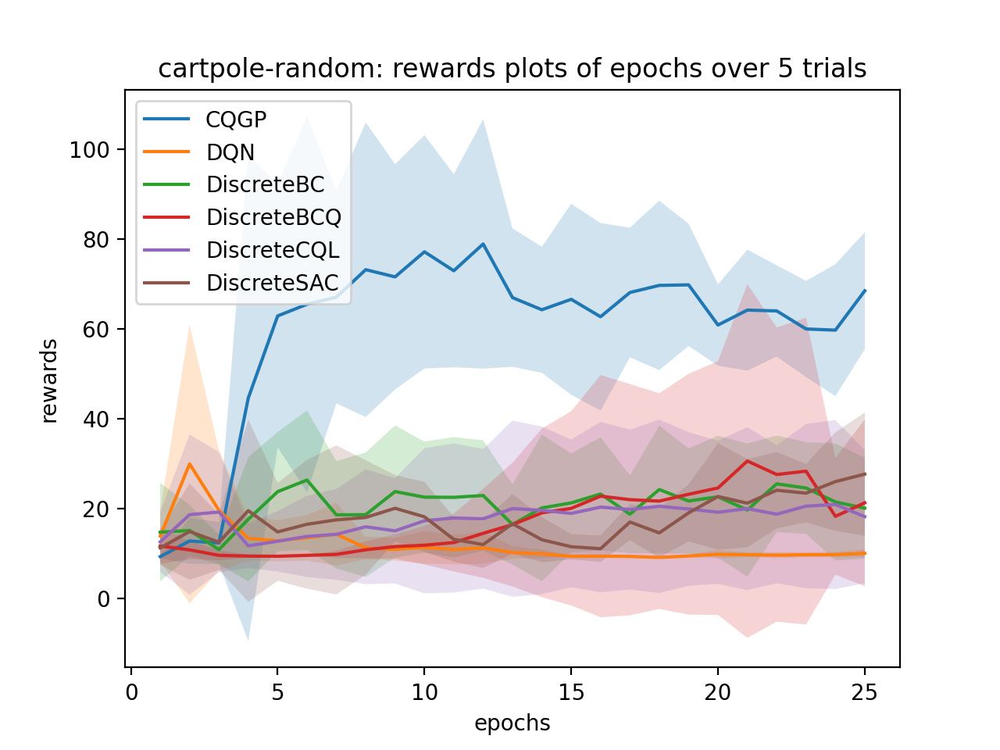

# CQGP: Robust Conservative Offline Q-Learning with Gaussian Processes

Course Project for Foundations of RL at ETH Zurich, [paperlink](cqgp_paper.pdf)

## Authors
* [@Jingyu Liu](https://github.com/Jingyu6)
* [@Songyan Hou](https://github.com/justinhou95)

## Abstract


Reinforcement learning (RL) has been shown successful to effectively solve challenging problems with enough feedbacks from the environment. But sufficient interaction with the environment can be expensive or infeasible in certain domains. Offline RL leverages large previously-collected static datasets to learn policies without accessing the environment. However, commonly used off-policy algorithms have been shown to suffer from the overestimation of the state-action values for the out-of-distribution data and the distributional shift between the behaviour policy and the learned policy, especially when training with complex and multi-modal data distributions. In this paper, we propose a robust conservative Q-Learning algorithm with Gaussian Process, which aims to address these limitations by regularizing the estimation of the Q values with the uncertainty of each state-action pairs provided by the Gaussian Process. We introduced a general Bayesian formulation of the algorithm and showed that it can achieve comparable results to the state-of-the-art offline RL algorithms and outperform several offline RL baselines in the classical control environments from OpenAI Gym.

## Project Structure
```
.
├── cqgp_paper.pdf
├── cqgp_poster.pdf
├── run.py <main script for experiment>
├── algo_factory.py <automatically create algorithm instances>
├── datasets.py <handling downloading, generating, and subsampling dataset>
├── gp_test.py <testing some parameters of the Gaussian Process>
├── metrics.py <currently not used>
├── scripts <run experiments>
│   ├── acrobot_replay.sh
│   └── cartpole_random.sh
│   └── cartpole_replay.sh
│   └── gen_acrobot_replay.sh
├── visualization <containing files for drawing the plots>
├── algo <main logic>
│   ├── sklearn_impl
│   │   ├── base.py <sklearn base class>
│   │   ├── cqgp_impl.py <sklearn implementation of Gaussian Process Q function>
│   └── cqgp.py <algorithm class for CQGP>

```

## Setup
To run experiments, install the following dependencies:
```
pip install -r requirement.txt
```
\[Required\] Install some other dependencies with the desired methods manually:
* [d3rlpy](https://github.com/takuseno/d3rlpy): the main offline rl framework used in the project.
* [stable-baselines3](https://github.com/DLR-RM/stable-baselines3): the PPO implementation for generating offline dataset.

May ask to install some other libraries due to different platforms and system settings (follow the instruction when error occur).

## Run Experiment
The datasets for CartPole-v0 will be automatically downloaded if not present by d3rl. But to get the dataset for Acrobot-v1, we need to run the following script to generate the dataset first:
```
bash scripts/gen_acrobot_replay.sh
```
To run the experiment, go to the root folder and run:
```
bash scripts/{acrobot_replay.sh,cartpole_random.sh,cartpole_replay.sh}
```
All the logs, saved models, and stats will be stored in the folder called **d3rlpy_logs** with appropriate experiment names. And the plots will show after finishing all the trainings. 
